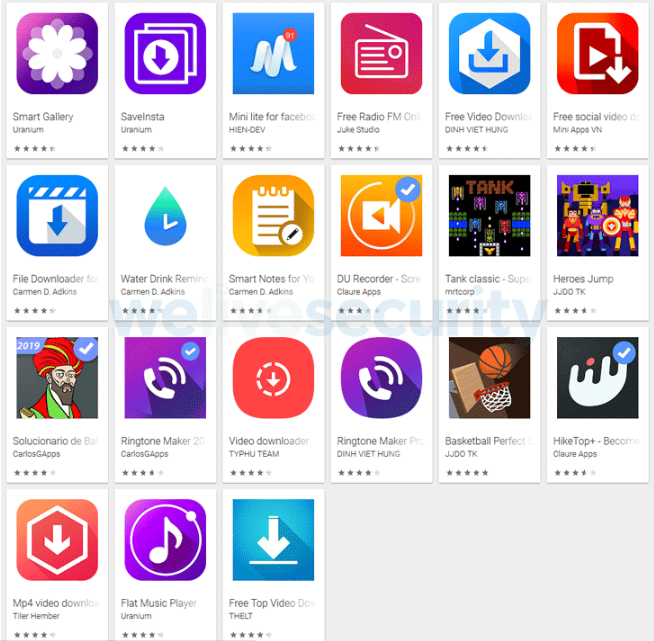

Lukas Stefanko, investigador de seguridad de ESET, descubrió que 42 aplicaciones se encontraban alojadas en la Play Store de Google contenian **adware** malicioso que se mostraba en pantalla completa en los dispositivos de las víctimas. Todas estas aplicaciones eran subidas de forma legítima, pero aprovechaban las distintas actualizaciones para inyectar código malicoso.

El código malicioso que se le agregaba a las aplicaciones era un **adware** de la familia **Ashas**, que conectaba a un servidor remoto controlado por el atacante y enviaba información de forma automática. Las 42 apps suman un total de más de 8 millones de descargar. Tras rastrear el origen de las aplicaciones, se le atribuyen a un estudiante de Vietnam ya que en los detalles de registro asociado a las aplicaciones estaban disponibles su nombre, dirección y número de teléfono.

